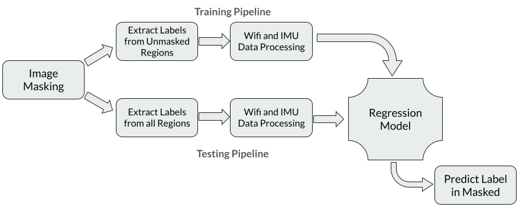
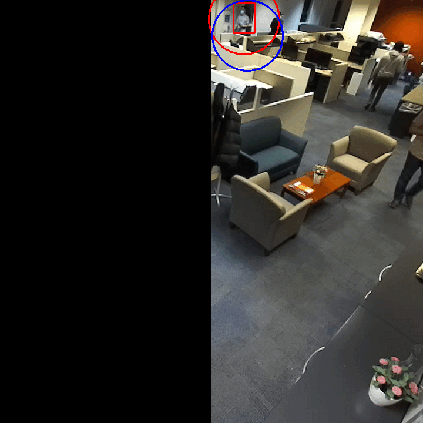
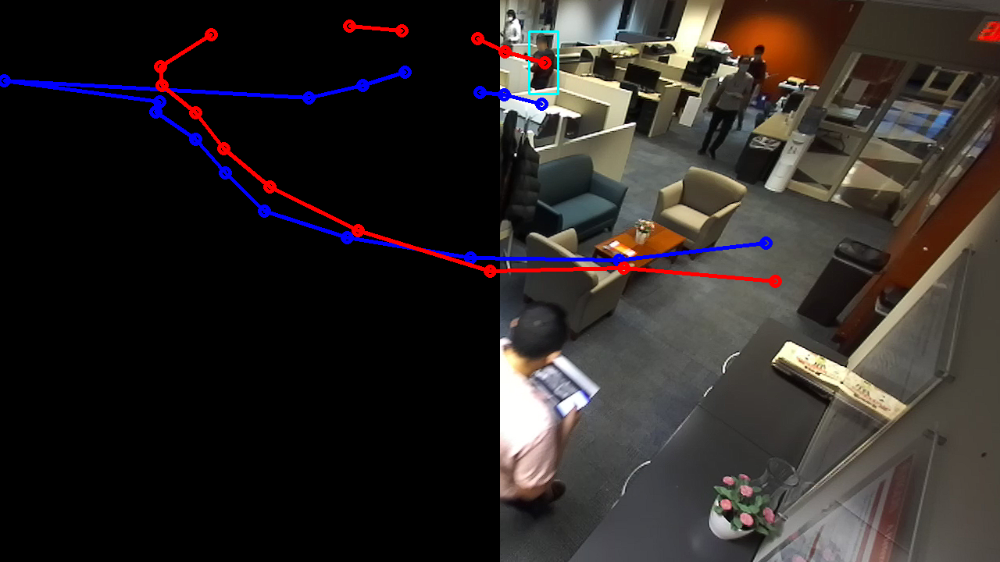

<!-- 1. Set Up a VENV using python venv. You can/should use the requirements.txt file
2. In the DATA.md, follow instructions to download the cleaned data
3. In the README.MD, follow the steps to run a docker container.

* MODIFIED DOCKER RUN COMMAND:
docker run -d --ipc=host --shm-size=16384m -it -v /path/to/proj:/path/to/proj --gpus all --network=bridge bryanbocao/vifit /bin/bash
    - Addy  : docker run -d --ipc=host --shm-size=16384m -it -v /home/addy1999/Desktop/'CSE 570 Proj':/share/home/addy1999/Desktop/'CSE 570 Proj' --network=bridge bryanbocao/vifit /bin/bash

    - Ash   :

* Run Command - to get started 
    - Addy  :     python3 Xformer_IFcC2C.py -ud -n -rm train -te 500 -nan linear_interp -tr_md_id Xformer_IFcC2C -m 'addy' -sc 0 -tsid_idx 5 -lw 30

# File project_main/src/data_scene0.py
- This file contains the method `get__scene0_synced_dataloaders()` to get dataloaders for the sequence `scene0/20201223_140951/`. 
- Use the function `get_scene0_synced_datasets()` to get the individual Datasets themselves
- Make sure the `DATA_ROOT` constant in this file points to your **Bo's Synced Data Folder** (i.e the `RAN4model_dfv4p4` folder)

pip install torch torchvision matplotlib Pillow -->

# Data Location
1. [Google Drive](https://drive.google.com/drive/folders/1fq2zsYxU7wuyFZo_Cs-kfliL1KTGYX_4?usp=sharing) with all the data.
2. [GitHub Repo](https://github.com/ashutiw2k/CSE570_ProjectData/tree/main) describing the data zip files. 

# Model Information and Results

Model Pipeline:

Subject Path GIF:
(Blue - Predicted, Red - True)

Subject Path Traced:
(Blue - Predicted, Red - True)

Video - Subject Path to and from Mask - Masked:
(Blue - Predicted, Red - True)

Video - Subject Path to and from Mask - UnMasked:
(Blue - Predicted, Red - True)

